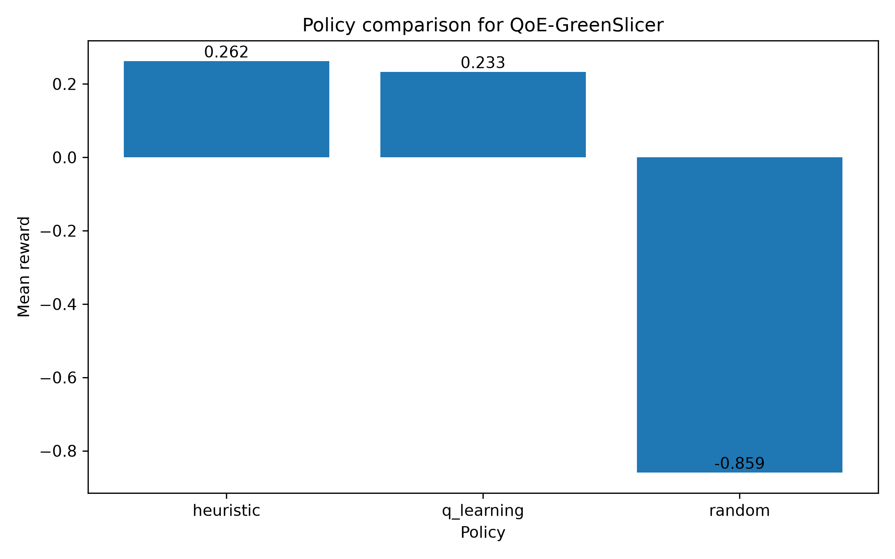

# QoE-GreenSlicer RL

A lightweight reinforcement-learning project for **QoE-aware and energy-aware 5G network slicing**.

The project is inspired by the QoE-GreenSlicer architecture: a controller observes traffic demand for URLLC, eMBB and mMTC slices, reallocates resources, and receives a reward based on the trade-off between user experience and energy consumption.

## Why this project matters

5G slicing must balance conflicting objectives:

- high user experience for latency-sensitive and bandwidth-intensive services;
- efficient use of radio/core resources;
- lower energy consumption;
- overload prevention.

This repository implements a small but complete research prototype that can be extended toward SAC/PPO or other DRL algorithms.

## Implemented features

- Synthetic 5G slicing environment with three slices: URLLC, eMBB and mMTC.
- Dynamic traffic demand with daily seasonality and burst events.
- QoE model based on slice utilization and service requirements.
- Normalized energy model with static and dynamic consumption.
- Reward function: `QoE - gamma * Energy - overload_penalty`.
- Three policies for comparison:
  - random policy;
  - heuristic resource-balancing policy;
  - tabular Q-learning policy.
- CSV results and a policy comparison plot.
- Dockerfile and GitHub Actions workflow.

## Project structure

```text
qoe-greenslicer-rl/
├── src/qoe_greenslicer_rl/
│   ├── environment.py       # slicing environment and reward function
│   ├── agents.py            # Q-learning, random and heuristic policies
│   ├── experiment.py        # training, evaluation and result export
│   └── config.py            # model parameters
├── scripts/run_experiment.py
├── tests/
├── requirements.txt
├── pyproject.toml
└── Dockerfile
```

## Quick start

```bash
python -m venv .venv
source .venv/bin/activate  # Windows: .venv\Scripts\activate
pip install -r requirements.txt
pip install -e .
python scripts/run_experiment.py
```

Results are saved in `results/`:

```text
episode_results.csv
policy_summary.csv
policy_comparison.png
```

## Docker

```bash
docker build -t qoe-greenslicer-rl .
docker run --rm qoe-greenslicer-rl
```

## Portfolio summary

This project demonstrates reinforcement learning, simulation, telecom domain knowledge, reward engineering, metric design, reproducible experiments, Docker and CI.

## Next improvements

- Replace tabular Q-learning with Soft Actor-Critic.
- Add continuous actions for radio and CPU resource allocation.
- Add real traffic traces or NS-3 generated traces.
- Add explicit base-station and 5G core energy models.
- Add Streamlit visualization for policy behavior.

## Results preview

The experiment compares three resource allocation policies for QoE-aware and energy-efficient 5G network slicing:

| Policy | Mean reward | Mean QoE | Mean energy | Overload events |
|---|---:|---:|---:|---:|
| Heuristic | 0.262 | 0.869 | 0.896 | 24.48 |
| Q-learning | 0.233 | 0.874 | 0.896 | 26.70 |
| Random | -0.859 | 0.804 | 0.871 | 92.53 |

The heuristic policy achieves the best overall reward and significantly reduces overload events compared with the random baseline.  
The Q-learning policy obtains the highest mean QoE, but with slightly more overload events in this lightweight experiment.



